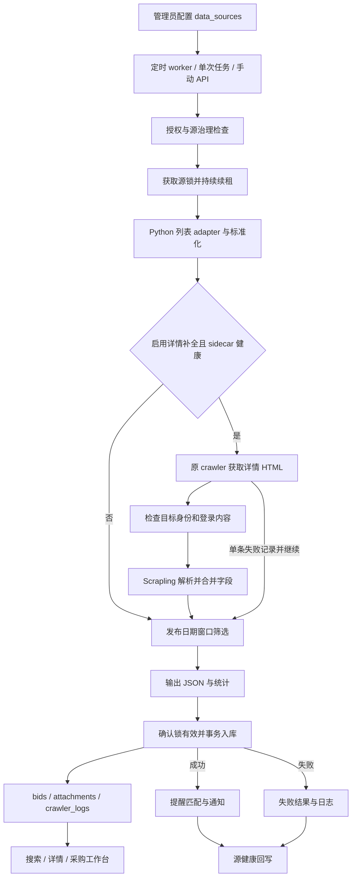

# 爬虫与 Scrapling 详情补全：全链路逻辑

## 1. 范围与职责

更新日期：2026-09-15。基于 `19286e8` 审查后修复的工作区版本。

Scrapling 负责解析 crawler 提供的 HTML；Python 负责列表和详情网络请求；Next.js 服务端负责入口授权、调度、持久化和提醒。数据复用 `data_sources`、`bids`、`bid_attachments`、`crawler_logs`，没有新业务表。SAM.gov 保留专用采集器，管理入口复用执行控制和 JSON 导入。

本次验证使用离线列表 fixture、保存的门户详情、真实本地 HTTP 解析服务、临时 SQLite 和隔离 MySQL 8。没有抓取线上门户、修改业务数据库或清理历史脏数据。历史实测单独保留在[详情补全运维记录](../operations/detail-enrichment.md)。

## 2. 总体流程

列表失败或入库失败使整源失败；单条详情失败保留列表结果。提醒异常单独返回 `postProcessingErrors`，不把已经成功的入库重新抓取。

## 3. 配置、入口与调度

- `CrawlerConfigPanel` 和 `server/admin/crawler-config.ts` 共用配置校验。数据源 PATCH 要求 admin/operator；修改治理状态要求 admin。
- `fetchConfig` **整体替换**；直接调用 API 时保留其他配置键。专用 adapter 可能有固定列表入口，`base_url` 并非所有源的统一 URL 开关。
- `worker:crawler` 默认每批结束等待 15 分钟，运行到期源并按错误类别重试；`crawler:once` 运行一轮；手动 API 显式运行源，不受 cadence 筛选，但执行相同治理与健康回写。
- `/api/crawler/state/run` 和 `/api/crawler/sam-gov/run` 接受有效 `CRAWLER_RUN_TOKEN` 或 admin/operator 会话。缺少 token 不自动放行。开发时可显式启用 `CRAWLER_ALLOW_UNAUTHENTICATED_LOCAL_RUN=true`，仅限 development/test 的回环请求；生产及 staging 禁止该例外。
- county/city 等地方源必须显式通过审批和法律审核；历史 state/federal 源保留现有兼容规则。
- 到期时间使用最近成功；连续失败时改用 `lastFailureAt`，按 cadence 指数退避，上限七天。manual 源不自动运行。
- 同级源交错平台，每个平台每批默认最多十个候选；当前批次串行执行。这是候选数量限制，不是跨进程平台限流器。

### 补全配置

| 配置 | 行为 |
| --- | --- |
| `enrichment.enabled` | 默认 false；只有布尔 true 启用 |
| `fields` | description、attachments、category、contact、published_date；空数组不抓详情 |
| `max_details_per_run` | 默认 25，范围 1–200，还受列表上限约束 |
| `min_interval_seconds` | 默认 3，范围 0–60，控制详情请求起始间隔 |
| `timeout_seconds` | 默认 20，范围 5–60，控制单次详情请求 |
| `detail_selectors` | 按字段组设置 CSS/XPath；显式选择器未命中不回退启发式 |
| `attachment_url_template` | 仅 HTTP(S)，使用页面真实数字 ID 和 source_bid_id 还原链接 |
| `SCRAPLING_EXTRACTOR_URL` | 设置在实际启动 Python 的 Node 进程；健康检查 3 秒、解析请求 10 秒 |

## 4. 获取、解析与字段契约

`state-runner.ts` 通过 stdin 启动 `python -m apsi_crawler.cli fetch-task`。adapter 优先按 source_id 匹配，再按 provider_family；没有适配器或原始列表为空时明确失败。stdout 只输出 JSON，诊断写 stderr。

补全候选基于本次列表对象，尚不读取历史数据库。正文会排除标题回显和无意义副本；联系人按姓名、邮箱、电话分别判断；已有附件仍可补充新链接。

详情必须是 HTTP(S)、HTTP 200、非空 HTML。抓取后检查 host、登录路径、路径身份和 `docId`/`SID` 等 query 身份，并检测同 URL 登录内容；超过 2 MiB 拒绝解析。不会执行网页 JavaScript或绕过登录。

解析器先使用显式选择器，否则使用正文与标签启发式。正文最多 20,000 字符；500 字符以内返回短正文，更长时另带完整正文。日期统一标准化，支持两位年份，并在诊断中保存原文本。整个解析响应先校验再合并，避免畸形响应造成部分写入。

| 数据 | 合并规则 |
| --- | --- |
| description / full_description | 清除标题回显和重复副本；允许更有信息的详情替换列表摘要，保留已完整正文。新短详情可显式清除旧长正文 |
| 分类、联系人、发布日期 | Python 按缺失子字段补全；入库以来源标记保护已补字段 |
| 附件 | 按 URL 优先、稳定 ID 辅助合并；不删除本次未观察到的附件 |
| 归档信息 | 发现链接或归档失败不能清除已有成功归档；新的完整归档可更新 |
| raw_payload.enrichment.fields | selector / heuristic / not_found 等解析诊断 |
| raw_payload.enrichment.applied_fields | 本次实际应用的 snake_case 字段，包含有意的 null 清除 |
| raw_payload.enrichment.persisted_fields | 导入器累积的已保留详情字段，阻止后续列表值降级 |
| detail_fetched_at | 成功获取并解析的时间，不等同于补全有效 |

例如，数据库已有完整正文和 A/B 附件，下次列表只返回简述及 A，原正文与 B 保留。解析成功但没有应用字段计 skipped；关闭补全后重抓仍保护旧详情和归档。

## 4b. 列表解析、已验证空态与治理前置检查

列表页解析同样按源配置（`fetch_config.list_extraction`：`mode`、`render`、`item_selector`、`max_items` 与六个字段 `selectors`；解析与校验在 `frontend/src/server/admin/crawler-config.ts` 的 `parseListExtractionConfig` / `serializeListExtractionConfig`，管理端"爬虫配置"面板的列表解析分组编辑）。默认 `mode: "scrapling"`：把已抓取的列表 HTML 交给抽取 sidecar 的 `POST /extract-list`，由自适应选择器与启发式产出条目，再经 `normalize_state_opportunity` 归一。sidecar 不可达、响应不合法或产出 0 条且非已验证空态时自动改用适配器解析，`metadata.listExtraction` 记录 `method`（`scrapling` / `adapter` / `adapter_fallback`）、`items`、逐字段 `diagnostics`、`rendered`、`fallback_reason`。**两条路径共用同一次列表请求**，礼貌策略与请求次数不变；`render: true` 时这一次请求改由 `services/browser-downloader` 的 `POST /render` 完成（只渲染公开页面，沿用登录墙/跨主机/超时守卫）。

页面明确写明"没有在招项目"时不再算解析失败。`content_quality.detect_empty_list` 要求同时满足：HTTP 200 且非 WAF 挑战页、命中窄集合的空态文案、并且源标签的特征词出现在标题或正文中（租户确认）。三条齐全则 `status = "success"`、`bids = []`、`metadata.emptyState = {verified, marker, tenant_confirmed, method}`，`validateCrawlerImport` 与第 5 节的 `dateFilter` 零条规则并列接受这种零条成功，源健康按成功回写；缺租户确认仍按空结果失败，避免抓错页面的源永远"成功"。

县/市/特别区行在人工批准前由 `orchestrator.ts` 的 `blockedReasonFor()` 拦截，Python 不会启动。`POST /api/admin/data-sources/[id]/precheck`（`src/server/admin/source-precheck.ts`，admin/operator）为这一决定提供证据：robots.txt 扫描 → 跳过门禁但不入库的 `limit=5` 试抓 → 仅在 404 时调用只读的 `discover-tenant`，返回 `ready | empty | needs_fix` 判定、robots 结论、试抓样本与所用列表解析器，以及可选的 `suggestedBaseUrl`（由管理员确认后才写回 `base_url`），并把结论落到 `robots_txt_*` / `live_health_*`。批准本身仍走既有的 `PATCH /api/admin/data-sources/[id]`，一次写入批准列与合规台账列。同平台限流由 `platform-deferral.ts` 处理：同 `provider_family` 的源间隔 `CRAWLER_PLATFORM_MIN_INTERVAL_MS`，其中一个遇挑战/限流后本批剩余同平台源记 `status: "deferred"`（不回写健康、不重试）。操作手册见 [`docs/operations/local-source-approval.md`](../operations/local-source-approval.md)。

## 5. 日期、持久化与用户消费

日期窗口在补全之后执行，缺失或无法解析的日期保留。合法零条成功必须带有效窗口、`kept=0`、正整数 dropped、`unparsed=0`；两种数据库都落成功日志。未经说明的空列表拒绝入库。

SQLite/MySQL 在同一事务写招标、附件和运行日志；MySQL 使用一个借用连接。任一写入失败回滚；释放连接后尽力写独立失败日志，因此单连接池不会等待自己。失败结果是 `CrawlerPersistenceError`，不更新成功时间、不发送本次成功提醒。数据库完全不可用时只能返回错误，不能保证错误日志入库。

详情展示通过 `getBidDescription` 选择有效正文；搜索与提醒查询包含 full_description。Scrapling 发现远程附件链接不代表文件已经下载，附件归档仍由既有归档流程负责。

### 指标口径

`metadata.enrichment` 在日期筛选之前统计：

- `attempted`：实际请求详情的条数。
- `enriched`：本次内存记录应用了至少一个字段，不等于数据库新增信息条数。
- `failed`：详情获取、解析或合并失败。
- `skipped`：包括未尝试和尝试后无字段变化。
- 正常循环结束时，输入条数 = enriched + failed + skipped；不要再加 attempted。
- 单条补全失败不改变整源列表成功状态；详情零收益尚没有独立健康降级状态。

## 6. 执行与容器

源锁默认十分钟，每三分之一 TTL 续租；每次任务使用唯一 owner，旧任务不能释放新锁。丢失锁时中止子进程，入库前检查所有权。管理入口的 SAM SQLite 使用 JSON 输出，由父进程持久化，避免 Python 提前写业务库。

`CRAWLER_TASK_TIMEOUT_MS` 默认 30 分钟，超时杀死子进程并返回 `CrawlerTaskTimeoutError`；`CRAWLER_PYTHON_BIN`、`CRAWLER_DIRECTORY` 支持显式运行环境。

- 宿主机：安装 crawler 依赖；sidecar 使用自己的 Python 3.12 环境和 `run-local.sh`，默认仅监听 127.0.0.1。
- Docker：从仓库根目录构建 `frontend/Dockerfile`。runner 提供 Next standalone 和 Python；worker 提供 tsx、脚本和同一 crawler。Alpine 安装 tzdata 以支持州源时区。
- Compose：sidecar 只在内部网络可达；`crawler-worker` 属于显式 `workers` profile。默认启动不调度外部抓取。
- 生产 worker 使用 MySQL、生产通知配置和部署平台调度；本地 Compose 是 SQLite 开发拓扑。

## 6b. 附件归档与修复

采集链路（`fetch-task` + 详情补全）只产出附件**链接**，落到 `bid_attachments`，`archive_status='not_archived'`；真正的下载、校验与修复由独立的附件修复 worker 承担，与列表页/详情页抓取彻底解耦。

链路：`frontend/scripts/attachment-repair-worker.ts`（默认 6 h，`--once` 可单跑）→ `runAttachmentRepairOnce`（`src/server/attachments/repair-service.ts`）→ 每源取 `crawler_locks` 租约 `attachment_repair:<source_id>`（与第 6 节同一套续租/丢锁中止机制）→ `python -m apsi_crawler.cli archive-attachments`（stdin JSON → stdout JSON，与 `fetch-task` 同一契约风格）→ 一个事务内写回 `bid_attachments` 并追加一条 `crawler_logs`（`source='attachment_repair'`）。SQLite 与 MySQL 双实现。

每轮两个阶段：

1. **复核**：对 `archived` 且 `verified_at` 超过 7 天的行做文件存在性 + checksum + 魔数校验，产出 `archive_missing` / `archive_corrupt` / `path_not_portable`（绝对路径但同相对路径可解析 → 只改元数据，不发请求）。
2. **修复**：按源分组选取异常（优先 `never_archived`，再到期的 `archive_failed`），每源不超过策略里的 `max_per_run`（默认 50），由 Python 按 `min_interval_seconds`（默认 3 s）节流下载。

分类与退避是纯函数（`src/server/attachments/anomaly.ts`）：`next_repair_at = now + 1h × 2^attempts`，上限 7 天；6 次后判 `unavailable`（30 天后再入队一次）；`login_wall` / `html_response` 连续 2 次即判 `unavailable`——那是站点机制，不是抖动。

内容校验在 Python 侧（`storage/archive_attachments.py` + `storage/content_sniff.py`）：魔数白名单决定 `content_type` 和扩展名，响应头只作兜底；`text/html` 响应或魔数判为 HTML 的内容**永不落盘**，记 `failed` + `html_response`（登录页为 `login_wall`）；URL 黑名单按路径段精确匹配（`/authority/` 放行、`/login/` 拦截）；请求头复用 `html/public_page.BROWSER_REQUEST_HEADERS` 并带 `Referer = 详情页 URL`；重定向脱靶复用 `enrichment.detect_off_target_redirect`；流式下载到 `max_bytes`（默认 50 MB）即中止并删除半成品。`storage_path` 一律是**相对归档根**的相对路径，换机器/进容器不失效。

每源策略在 `data_sources.fetch_config.attachments`（`archive` / `mode` / `max_per_run` / `min_interval_seconds` / `timeout_seconds` / `max_bytes` / `browser_link_selector`），由 `src/server/attachments/policy.ts` 校验，管理端"爬虫配置"面板的附件分组编辑，与补全配置走同一条 `PATCH /api/admin/data-sources/[id]`（整体替换 `fetch_config`）。

`mode: "browser"` 的源（例如 Illinois BidBuy——直连 GET 只返回 `ERROR IN … session` 的 HTML）把下载交给 `services/browser-downloader` sidecar（`BROWSER_DOWNLOADER_URL`）：在公开详情页上定位并点击下载控件，等待 Playwright `download` 事件，结果仍走与直连**完全相同**的魔数校验与落盘流程。边界与解析 sidecar 一致且更严：不输入凭证、不过验证码、不绕 WAF，遇登录页返回 `LOGIN_WALL`，导航离开 `allowed_hosts` 即中止，单并发，内存中转不落盘，compose 内不发布宿主机端口。sidecar 不可达记 `browser_unavailable` 并退避，不会让整轮失败。

运维（命令、SQL、首轮历史数据行为、容器拓扑）见[附件归档与修复运维](../operations/attachment-repair.md)。

## 7. 验证与保留边界

跨语言回归使用仓库 IL 列表 fixture（合成样例）和保存的 IL 详情 HTML，经真实 adapter、CLI、HTTP sidecar、JSON 导入、数据库读取、展示选择和关键词查询；再关闭补全重复导入。MySQL 使用随机独立 schema，验证零条成功、正文与附件回滚、失败日志及单连接池行为。

CI 已加入 Python crawler、extractor 和 SQLite/MySQL 集成 job。前端测试限定源目录，避免 Next standalone 复制的测试被重复执行。具体命令与运行结果见[修复验证记录](../operations/crawler-hardening-verification.md)。

尚未实现历史数据库缺失队列、按 detail_fetched_at 的回填冷却、浏览器渲染和跨 worker 平台限流。历史 NY 登录描述、IL 误提取联系人不会自动清理。线上门户的 TLS、限流、登录和页面改版仍需按源小批次实测；离线测试不能证明所有外部站点当前可用。

2026-09-16 独立审查（Opus 5 三路并行）后确认修复：附件 URL 仅做大小写/端口/fragment 归一去重；apex→www 重定向不再判为脱靶；带站点级登录组件的公开详情页不再判为登录墙；`mm/dd/yyyy hh:mm AM/PM` 日期可解析；标题回显忽略首尾标点（Python 与 TS 同规则）；附件模板 `{source_bid_id}` 做百分号编码；两种数据库均按主键、再按 `dedupe_key` 定位既有行；MySQL 只在提交前短暂锁定租约行，避免阻塞心跳续租；锁丢失不计入源健康失败；子进程非零退出不会把 success 文档写成成功日志；SAM.gov 托管导入尊重 `DATABASE_PATH`；列表卡片、意向页与详情页共用 `getBidDescription`。

审查后仍保留的已知边界（有意为之或需产品决策）：

- 补全候选没有历史视角：列表描述缺失的源每次都会重新抓取前 `max_details_per_run` 条，之后的记录在该上限内永远轮不到；需要 Node 把 `detail_fetched_at` 注入任务或实现轮转/冷却。
- 附件只增不删：附件 URL 带会话/随机参数的门户会在每次运行追加整组附件；后续需要 URL 规范化键或 last-seen 清理。
- 更新的详情可以替换旧详情：解析器返回更短的权威正文并显式清空 `full_description` 时，旧长正文会被替换（门户改版即如此），这不是列表降级，属于设计取舍。
- 运行入口的本地放行以 `Host` 头判断回环；`NODE_ENV=development` 且 `ADMIN_UI_LOCAL_BYPASS=true` 的机器不应暴露到公网。
- 解析器附件回退没有噪声祖先过滤：站点级页脚的文档链接可能被当作每条招标的附件（三份真实 fixture 未复现）。
